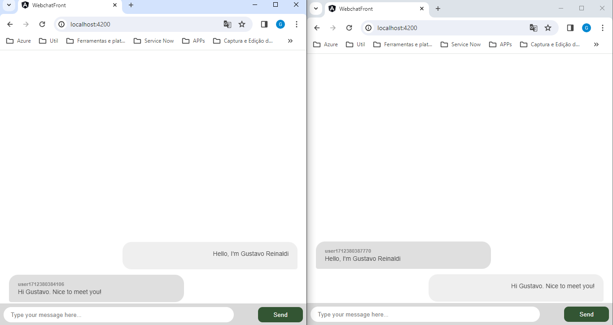

# WebChat

This is an implementation of WebSockets in a web chat format. Basically, this is an application of Websockets concepts for study purposes.

I hope you like my implementation.

## Run Frontend

1. Open the console in the `webchat-front` directory.
2. Run `npm install` to install all dependencies.
3. Run `ng serve` for a dev server. Navigate to `http://localhost:4200/`.

## Run Backend

1. Open the console in the `web-socket-back` directory. 
2. Run `npm install` and then run `node src/index.js` to start server. 
3. By default you can find the server in `http://localhost:8080`.

## Build frontend

Run `ng build` to build the project. The build artifacts will be stored in the `dist/` directory.

## Running unit tests

Run `ng test` to execute the unit tests via [Karma](https://karma-runner.github.io).

## Running end-to-end tests

Run `ng e2e` to execute the end-to-end tests via a platform of your choice. To use this command, you need to first add a package that implements end-to-end testing capabilities.